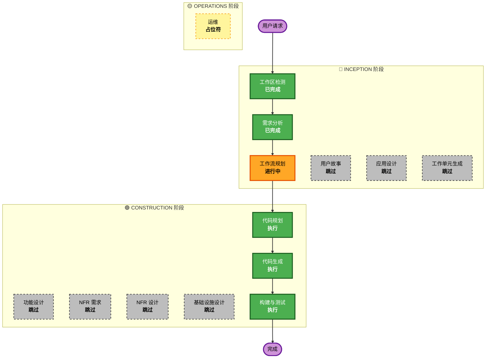

# 执行计划 - WHIP 协议支持

## 详细分析摘要

### 变更影响评估
- **用户面向变更**: 否 - 后端 API 扩展
- **结构变更**: 是 - 新增独立 HTTP 服务模块
- **数据模型变更**: 否 - 使用内存资源管理
- **API 变更**: 是 - 新增 WHIP REST API 端点
- **NFR 影响**: 低 - 性能要求明确

### 风险评估
- **风险级别**: 低
- **回滚复杂度**: 简单 - 独立模块，易于移除
- **测试复杂度**: 简单 - 标准 HTTP API 测试

### 组件关系
- **主要组件**: signaling_server.py (扩展)
- **新增组件**: whip_resource_manager.py
- **配置变更**: config.py
- **依赖组件**: 无 - 独立于现有 WebSocket 信令

## 工作流可视化

## 阶段执行决策

### 🔵 INCEPTION 阶段

| 阶段 | 状态 | 理由 |
|------|------|------|
| 工作区检测 | ✅ 已完成 | 棕地项目，代码已存在 |
| 需求分析 | ✅ 已完成 | 需求已收集并批准 |
| 用户故事 | ⏭️ 跳过 | 无用户界面变更，API 功能明确 |
| 工作流规划 | 🔄 进行中 | 当前阶段 |
| 应用设计 | ⏭️ 跳过 | 单模块扩展，结构简单 |
| 工作单元生成 | ⏭️ 跳过 | 单一工作单元，无需分解 |

### 🟢 CONSTRUCTION 阶段

| 阶段 | 状态 | 理由 |
|------|------|------|
| 功能设计 | ⏭️ 跳过 | 需求文档已明确功能细节 |
| NFR 需求 | ⏭️ 跳过 | 无特殊非功能需求 |
| NFR 设计 | ⏭️ 跳过 | 无 NFR 需求，无需设计 |
| 基础设施设计 | ⏭️ 跳过 | 无云基础设施变更 |
| 代码规划 | ✅ 执行 | 需要规划代码实现步骤 |
| 代码生成 | ✅ 执行 | 核心实现阶段 |
| 构建与测试 | ✅ 执行 | 验证实现正确性 |

### 🟡 OPERATIONS 阶段

| 阶段 | 状态 | 理由 |
|------|------|------|
| 运维 | 🔜 占位符 | 未来扩展 |

## 执行阶段摘要

### 将要执行的阶段 (3 个)
1. **代码规划** - 创建详细的代码实现计划
2. **代码生成** - 实现 WHIP 功能代码
3. **构建与测试** - 验证功能正确性

### 将要跳过的阶段 (8 个)
1. 用户故事 - 无用户界面变更
2. 应用设计 - 单模块扩展
3. 工作单元生成 - 单一单元
4. 功能设计 - 需求已明确
5. NFR 需求 - 无特殊需求
6. NFR 设计 - 无 NFR 需求
7. 基础设施设计 - 无基础设施变更
8. 运维 - 占位符

## 实现范围

### 需要修改的文件
| 文件 | 变更说明 |
|------|----------|
| `config.py` | 添加 WHIP 端口配置 |
| `signaling_server.py` | 添加 WHIP HTTP 服务启动逻辑 |

### 需要新增的文件
| 文件 | 说明 |
|------|------|
| `whip_resource_manager.py` | WHIP 资源管理模块 |
| `whip_server.py` | WHIP HTTP 服务处理 |

## 预估时间
- **总阶段数**: 3 个
- **预估时长**: 30-45 分钟

## 成功标准
- **主要目标**: WHIP 协议完整实现
- **关键交付物**:
  - WHIP HTTP 服务 (POST /whip/, DELETE /whip/<id>)
  - WHIP 资源管理器
  - 构建和测试文档
- **质量门控**:
  - HTTP API 符合 WHIP 协议规范
  - 资源正确管理和清理
  - 错误处理完善
