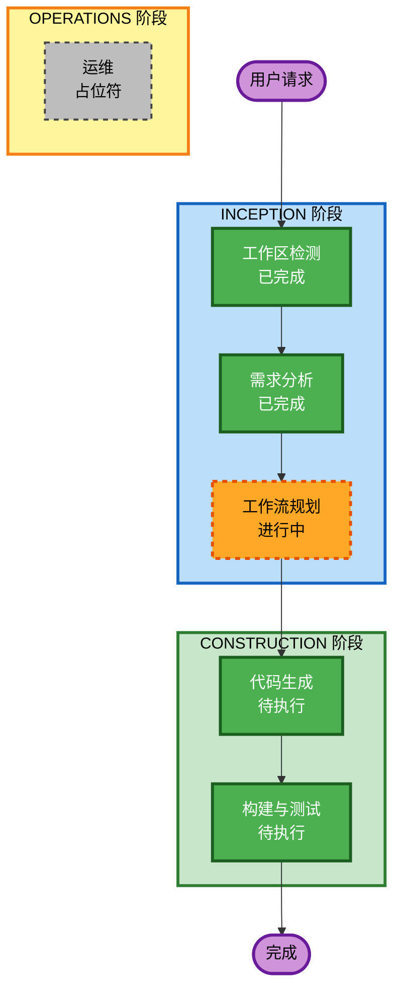

# 执行计划

## 详细分析摘要

### 变更影响评估
| 影响领域 | 评估 |
|----------|------|
| 用户面向变更 | 是 - Web Demo 页面提供用户交互界面 |
| 结构性变更 | 是 - 新建信令服务器和前端 Demo |
| 数据模型变更 | 否 - 无持久化存储需求 |
| API 变更 | 是 - WebSocket 信令协议实现 |
| NFR 影响 | 是 - 需要 WSS 安全连接支持 |

### 风险评估
| 风险维度 | 评估 | 说明 |
|----------|------|------|
| 风险等级 | 低 | 绿地项目，无历史包袱 |
| 回滚复杂度 | 简单 | 直接删除即可 |
| 测试复杂度 | 中等 | 需要 WebRTC 端到端测试 |

---

## 工作流可视化

---

## 阶段执行计划

### INCEPTION 阶段
- [x] 工作区检测 - **已完成**
- [x] 需求分析 - **已完成**
- [x] 工作流规划 - **进行中**
- [ ] 用户故事 - **跳过**
  - 理由: 项目范围明确，用户故事已在需求文档中描述
- [ ] 应用设计 - **跳过**
  - 理由: 项目结构简单，直接进入代码生成
- [ ] 工作单元生成 - **跳过**
  - 理由: 单一服务单元，无需拆分

### CONSTRUCTION 阶段
- [ ] 功能设计 - **跳过**
  - 理由: 功能明确，无需详细设计文档
- [ ] NFR 需求 - **跳过**
  - 理由: NFR 需求已在需求文档中定义
- [ ] NFR 设计 - **跳过**
  - 理由: 无复杂 NFR 模式需要设计
- [ ] 基础设施设计 - **跳过**
  - 理由: 本地测试项目，无云基础设施需求
- [ ] 代码生成 - **执行**
  - 理由: 需要实现信令服务器和 Web Demo
- [ ] 构建与测试 - **执行**
  - 理由: 需要验证功能正确性

### OPERATIONS 阶段
- [ ] 运维 - **占位符**
  - 理由: 未来部署和监控工作流

---

## 代码生成计划

### 单元 1: 信令服务器 (Python)
**文件清单**:
- `signaling_server.py` - 主服务器程序
- `room_manager.py` - 房间/会话管理
- `config.py` - 配置文件
- `generate_cert.py` - SSL 证书生成脚本
- `requirements.txt` - Python 依赖

**功能点**:
- WebSocket 服务端 (WS/WSS)
- SDP Offer/Answer 交换
- ICE Candidate 转发
- 一对一通话配对
- 自签名证书支持

### 单元 2: Web Demo (HTML/JS)
**文件清单**:
- `static/index.html` - 主页面
- `static/app.js` - WebRTC 客户端逻辑
- `static/style.css` - 样式文件

**功能点**:
- 本地视频预览
- 远端视频显示
- WebRTC 连接管理
- 信令消息收发
- STUN/TURN 配置

---

## 预估时间
- 代码生成: ~30 分钟
- 构建与测试: ~10 分钟

---

## 成功标准
- [ ] 信令服务器能够启动并监听端口
- [ ] 支持 WS 和 WSS 两种连接模式
- [ ] 两个客户端能够交换 SDP 并建立连接
- [ ] Web Demo 页面能够正常显示本地/远端视频
- [ ] 音视频双向通信正常
